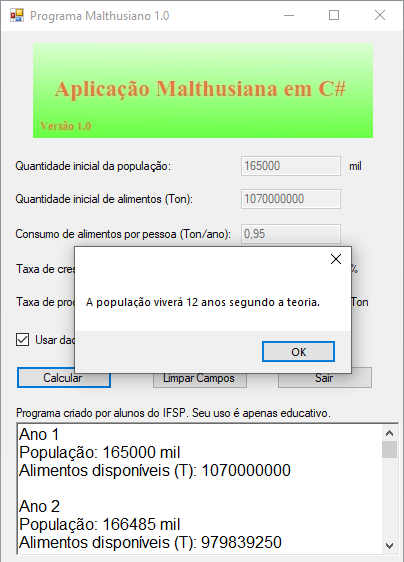

# Malthusianismo

Simulador de escassez de alimentos pela teoria malthusiana, criada para a I FATIF do IFSP Cubatão (2013).

A ideia deste projeto foi mostrar o quão errada esta teoria era, como seu criador não previu avanços tecnológicos na produção de alimentos e qualidade de vida geral, além de outros aspectos gerais como a transição demográfica.

Criado e apresentado em grupo por um [Marcos](github/fatif.jpg) com 15 anos de idade 🤓.